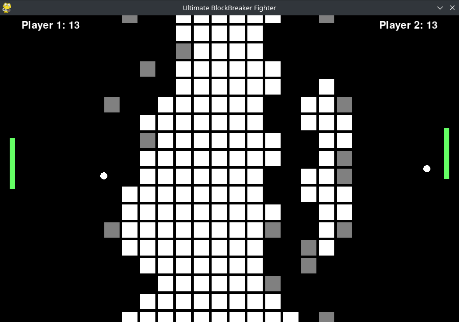

# UltimateBlockBreakerFighter

## Creators: [Giovanni](https://github.com/Giojoe10) and [Juan](https://github.com/Giojoe10)

This is a repository for a local multiplayer Block Breaker game for two players with score system.



## Tutorial

Install the requirements packages
``` bash
pip install -f requirements.txt
```

Run main.py and enjoy
```bash
python main.py
``` 


